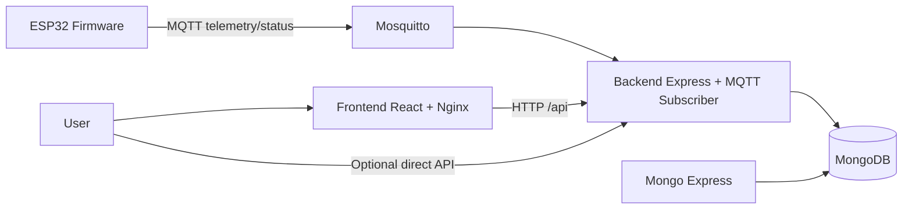
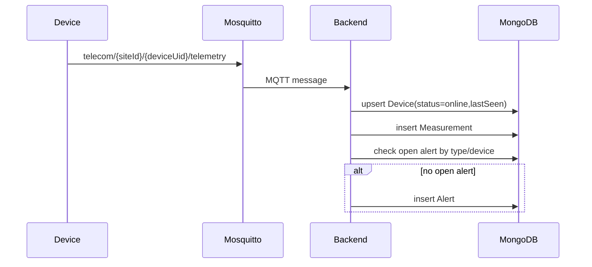

# Architecture

## System Overview

## Backend Internal Flow

## Frontend
- React + Vite SPA served by Nginx.
- Nginx proxies `/api/*` to backend service (`http://backend:3000` in container network).
- JWT stored in browser localStorage.
